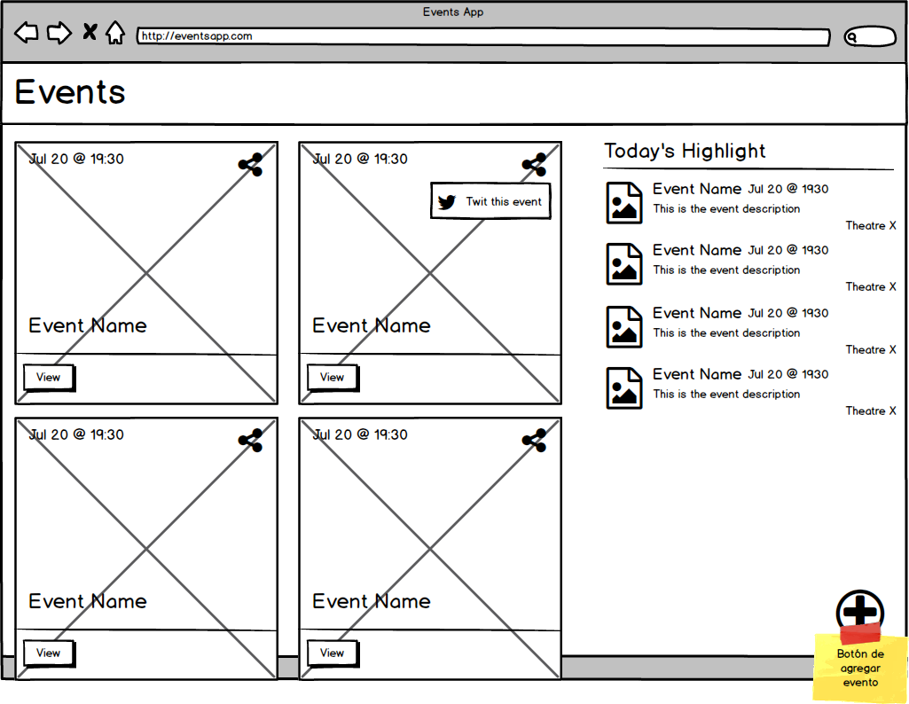
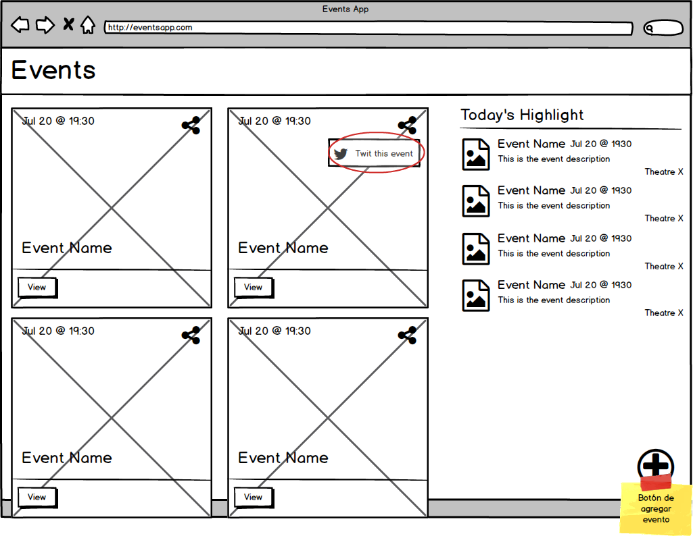
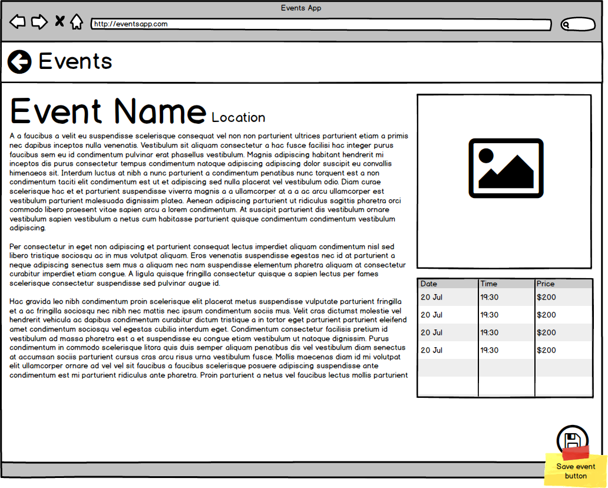
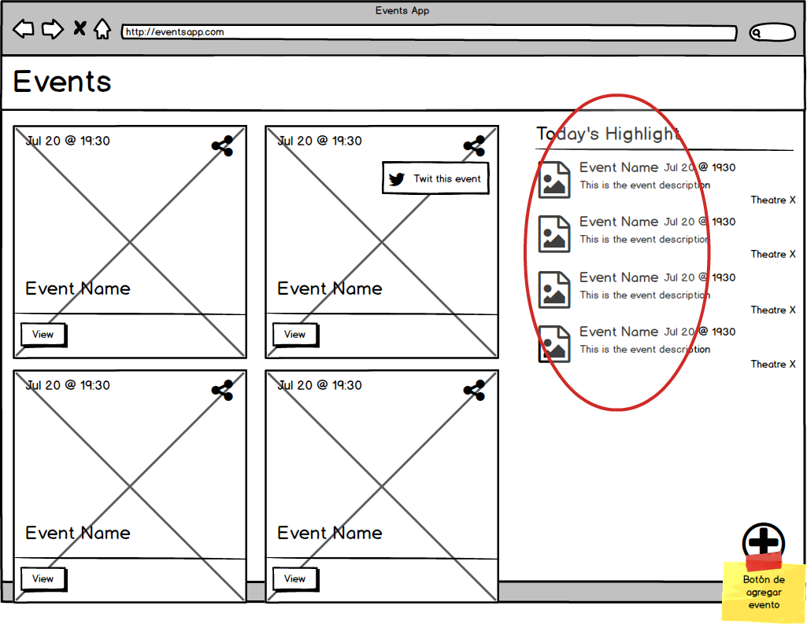
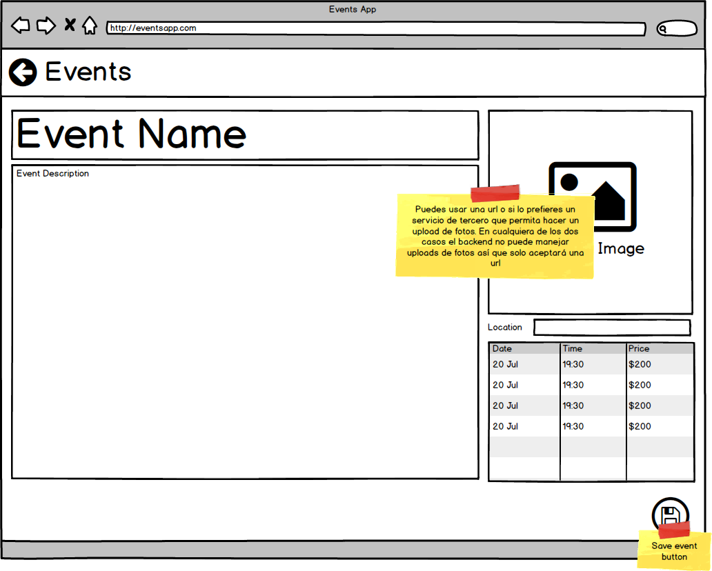

# Prueba de Ingenious Softworks para candidatos - Letra

Hola **candidato**, esperamos que hayas seguido los pasos para [instalar y probar](../backend) la aplicación backend, si tienes alguna duda nos puedes enviar un email a [gchertok@ingsw.com](mailto: gchertok@ingsw.com).

## Índice
* [Letra](#letra)
* [Requerimientos no funcionales](#requerimientos-no-funcionales)
* [Evaluación](#evaluación)
* [Preguntas Frecuentes](#faq)
* [Siguiente paso](#siguiente-paso)

## Letra

Se pide desarrollar una Single Page Application que lista y permite crear eventos. El sistema final será una cartelera de eventos muy simple.

Para desarrollarla proveemos un [backend](../backend) con todos los servicios necesarios.

## Historias de usuario

### Listar eventos

Como un usuario debo ver un listado inicial de eventos ordenados por fecha.

### Compartir evento

Como un usuario haciendo click en el botón compartir de un evento debo poder compartir el mismo en twitter.

El mensaje de twitter deberá ser el siguiente: "Iré al NOMBRE DEL EVENTO @ FECHA DEL EVENTO LINK DEL EVENTO".

### Ver detalle del evento

Como un usuario haciendo click en un evento debo navegar a otra página de detalle que liste, además del nombre del evento el resto de sus atributos.

### Listar eventos destacados

Como un usuario en la página principal debo ver un listado de eventos destacados.

### Crear evento

Como un usuario debería poder crear un evento con todos sus campos.

* Título
* Descripción
* Lista de fechas
* Lugar
* Imágen

## Requerimientos no funcionales

La aplicación cliente deberá estar escrita en alguna de las siguientes tecnologías:

* JavaScript vanilla
* Ember
* Angular
* React
* Vue
* Cualquier otro framework JS

No se especifica ninguna versión mínima para las mismas pero es de esperarse que sean versiones estables y soportadas, no es necesario hacer la aplicación en el último release de cada tecnología pero si es un release con soporte.

## Evaluación

La prueba trata de evaluar como un candidato maneja cierta tecnología pero además cómo estructura su código y cómo resuelve los problemas que se le presentan. 

Con esto queremos decir que si bien la tecnología en cual se realice la aplicación es importante, también lo es desarrollarla con una herramienta con la que el candidato se sienta cómodo y pueda ser eficiente.

De nada sirve entregar una aplicación "andando" en React que no utilice las características del framework, el mismo caso se da si se eligen otros frameworks.

## FAQ

### Puedo modificar la aplicación backend para hacer cierta funcionalidad?

Sí, es posible modificar la aplicación backend. Recuerda enviarnos la versión modificada para que podamos probarla.

### Hay algo en la letra que no quedó claro pero tengo dificultades para comunicarse por email

Si estás en esta situación asume lo que te sea más cómodo y continúa con la prueba. Si es posible deja constancia de la decisión tomada para poder evaluar la prueba en base a ella.

Por ejemplo, si no queda claro qué atributos de evento debes listar en la página principal asume unos y continúa adelante.

Recuerda que es una prueba para evaluar tu conocimiento no un trabajo para un cliente real.

### Tengo un error corriendo la aplicación backend

Lo mejor que puedes hacer es enviarnos un correo electrónico a [gchertok@ingsw.com](mailto: gchertok@ingsw.com) y trataremos de solucionarlo lo antes posible.

### No entiendo lo que se pide en la letra

De nuevo, lo ideal es enviarnos un correo electrónico a [gchertok@ingsw.com](mailto: gchertok@ingsw.com) y trataremos de aclarar la duda.

### Me sobró tiempo y quisiera agregarle funcionalidades a la aplicación

Si bien las funcionalidades extra son un plus preferimos que las presentes estén lo más completas posibles. Si te ha sobrado tiempo sería interesante que agregaras **tests** y escribieras **documentación** sobre la app que has desarrollado.

### Soy proficiente en más de una de las tecnologías mencionadas, cuál elijo?

Si dudas en cual tecnología desarrollar y eres capaz de manejar más de una de ellas nuestra recomendación es que desarrolles con la que te seintas más cómodo.

## Siguiente paso

Ya puedes empezar a desarrollar la aplicación dentro del directorio `frontend`. Mucha suerte!
